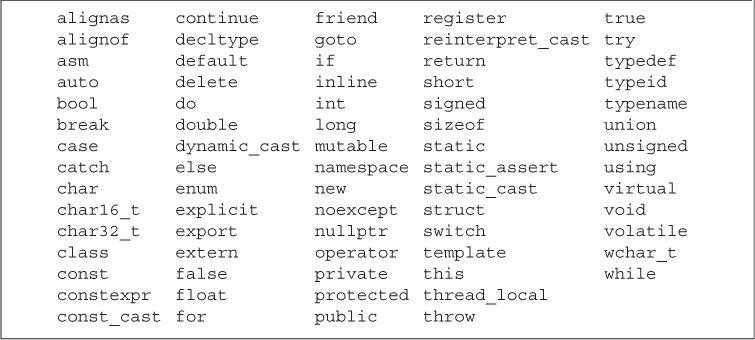

# 第 2 章 变量和基本类型(Variables and Basic Types)

## 2.1 基本内置类型 (Primitive Built-in Types)

### 2.1.1 算数类型 (Arithmetic Types)

算数类型分为两类：整型（integral type）、浮点型（floating-point type）。


`bool`类型的取值是`true`或`false`。

一个`char`的大小和一个机器字节一样，确保可以存放机器基本字符集中任意字符对应的数字值。`wchar_t`确保可以存放机器最大扩展字符集中的任意一个字符。

在整型类型大小方面，C++规定`short` ≤ `int` ≤ `long` ≤ `long long`（`long long`是 C++11 定义的类型）。

浮点型可表示单精度（single-precision）、双精度（double-precision）和扩展精度（extended-precision）值，分别对应`float`、`double`和`long double`类型。

除去布尔型和扩展字符型，其他整型可以分为带符号（signed）和无符号（unsigned）两种。带符号类型可以表示正数、负数和 0，无符号类型只能表示大于等于 0 的数值。类型`int`、`short`、`long`和`long long`都是带符号的，在类型名前面添加`unsigned`可以得到对应的无符号类型，如`unsigned int`。

字符型分为`char`、`signed char`和`unsigned char`三种，但是表现形式只有带符号和无符号两种。类型`char`和`signed char`并不一样， `char`的具体形式由编译器（compiler）决定。

如何选择算数类型：

- 当明确知晓数值不可能为负时，应该使用无符号类型。
- 使用`int`执行整数运算，如果数值超过了`int`的表示范围，应该使用`long long`类型。
- 在算数表达式中不要使用`char`和`bool`类型。如果需要使用一个不大的整数，应该明确指定它的类型是`signed char`还是`unsigned char`。
- 执行浮点数运算时建议使用`double`类型。

### 2.1.2 类型转换 (Type Conversions)

进行类型转换时，类型所能表示的值的范围决定了转换的过程。

- 把非布尔类型的算术值赋给布尔类型时，初始值为 0 则结果为`false`，否则结果为`true`。
- 把布尔值赋给非布尔类型时，初始值为`false`则结果为 0，初始值为`true`则结果为 1。
- 把浮点数赋给整数类型时，进行近似处理，结果值仅保留浮点数中的整数部分。
- 把整数值赋给浮点类型时，小数部分记为 0。如果该整数所占的空间超过了浮点类型的容量，精度可能有损失。
- 赋给无符号类型一个超出它表示范围的值时，结果是初始值对无符号类型表示数值总数（8 比特大小的`unsigned char`能表示的数值总数是 256）取模后的余数。
- 赋给带符号类型一个超出它表示范围的值时，结果是未定义的（undefined）。

避免无法预知和依赖于实现环境的行为。

无符号数不会小于 0 这一事实关系到循环的写法。

```C++
// WRONG: u can never be less than 0; the condition will always succeed
for (unsigned u = 10; u >= 0; --u)
    std::cout << u << std::endl;
```

当*u*等于 0 时，*--u*的结果将会是 4294967295。一种解决办法是用`while`语句来代替`for`语句，前者可以在输出变量前先减去 1。

```c++
unsigned u = 11;    // start the loop one past the first element we want to print
while (u > 0)
{
    --u;    // decrement first, so that the last iteration will print 0
    std::cout << u << std::endl;
}
```

不要混用带符号类型和无符号类型。

### 2.1.3 字面值常量 (Literals)

以`0`开头的整数代表八进制（octal）数，以`0x`或`0X`开头的整数代表十六进制（hexadecimal）数。在 C++14 中，`0b`或`0B`开头的整数代表二进制（binary）数。

整型字面值具体的数据类型由它的值和符号决定。

C++14 新增了单引号`'`形式的数字分隔符。数字分隔符不会影响数字的值，但可以通过分隔符将数字分组，使数值读写更容易。

```c++
// 按照书写形式，每3位分为一组
std::cout << 0B1'101;   // 输出"13"
std::cout << 1'100'000; // 输出"1100000"
```

浮点型字面值默认是一个`double`。

由单引号括起来的一个字符称为`char`型字面值，双引号括起来的零个或多个字符称为字符串字面值。

字符串字面值的类型是由常量字符构成的数组（array）。编译器在每个字符串的结尾处添加一个空字符`'\0'`，因此字符串字面值的实际长度要比它的内容多一位。

转义序列：

|      含义       | 转义字符 |
| :-------------: | :------: |
|     newline     |   `\n`   |
| horizontal tab  |   `\t`   |
|  alert (bell)   |   `\a`   |
|  vertical tab   |   `\v`   |
|    backspace    |   `\b`   |
|  double quote   |   `\"`   |
|    backslash    |   `\\`   |
|  question mark  |   `\?`   |
|  single quote   |   `\'`   |
| carriage return |   `\r`   |
|    formfeed     |   `\f`   |

```c++
std::cout << '\n';      // prints a newline
std::cout << "\tHi!\n"; // prints a tab followd by "Hi!" and a newline
```

泛化转义序列的形式是`\x`后紧跟 1 个或多个十六进制数字，或者`\`后紧跟 1 个、2 个或 3 个八进制数字，其中数字部分表示字符对应的数值。如果`\`后面跟着的八进制数字超过 3 个，则只有前 3 个数字与`\`构成转义序列。相反，`\x`要用到后面跟着的所有数字。

```c++
std::cout << "Hi \x4dO\115!\n"; // prints Hi MOM! followed by a newline
std::cout << '\115' << '\n';    // prints M followed by a newline
```

添加特定的前缀和后缀，可以改变整型、浮点型和字符型字面值的默认类型。


使用一个长整型字面值时，最好使用大写字母`L`进行标记，小写字母`l`和数字`1`容易混淆。

## 2.2 变量 (Variables)

### 2.2.1 变量定义 (Variable Definitions)

变量定义的基本形式：类型说明符（type specifier）后紧跟由一个或多个变量名组成的列表，其中变量名以逗号分隔，最后以分号结束。定义时可以为一个或多个变量赋初始值（初始化，initialization）。

初始化不等于赋值（assignment）。初始化的含义是创建变量时赋予其一个初始值，而赋值的含义是把对象的当前值擦除，再用一个新值来替代。

用花括号初始化变量称为列表初始化（list initialization）。当用于内置类型的变量时，如果使用了列表初始化并且初始值存在丢失信息的风险，则编译器会报错。

```c++
long double ld = 3.1415926536;
int a{ld}, b = {ld};    // error: narrowing conversion required
int c(ld), d = ld;      // ok: but value will be truncated
```

如果定义变量时未指定初值，则变量被默认初始化（default initialized）。

对于内置类型，定义于任何函数体之外的变量被初始化为 0，函数体内部的变量将不被初始化（uninitialized）。

定义于函数体内的内置类型对象如果没有初始化，则其值未定义，使用该类值是一种错误的编程行为且很难调试。类的对象如果没有显式初始化，则其值由类确定。

建议初始化每一个内置类型的变量。

### 2.2.2 变量声明和定义的关系 (Variable Declarations and Definitions)

声明（declaration）使得名字为程序所知。一个文件如果想使用其他地方定义的名字，则必须先包含对那个名字的声明。

定义（definition）负责创建与名字相关联的实体。

如果想声明一个变量而不定义它，就在变量名前添加关键字`extern`，并且不要显式地初始化变量。

```c++
extern int i; // declares but does not define i
int j;      // declares and defines j
```

`extern`语句如果包含了初始值就不再是声明了，而变成了定义。

变量能且只能被定义一次，但是可以被声明多次。

如果要在多个文件中使用同一个变量，就必须将声明和定义分开。此时变量的定义必须出现且只能出现在一个文件中，其他使用该变量的文件必须对其进行声明，但绝对不能重复定义。

### 2.2.3 标识符 (Identifiers)

C++的标识符由字母、数字和下划线组成，其中必须以字母或下划线开头。标识符的长度没有限制，但是对大小写字母敏感。C++为标准库保留了一些名字。用户自定义的标识符不能连续出现两个下划线，也不能以下划线紧连大写字母开头。此外，定义在函数体外的标识符不能以下划线开头。



### 2.2.4 名字的作用域 (Scope of a Name)

定义在函数体之外的名字拥有全局作用域（global scope）。声明之后，该名字在整个程序范围内都可使用。

最好在第一次使用变量时再去定义它。这样做更容易找到变量的定义位置，并且也可以赋给它一个比较合理的初始值。

作用域中一旦声明了某个名字，在它所嵌套着的所有作用域中都能访问该名字。同时，允许在内层作用域中重新定义外层作用域已有的名字，此时内层作用域中新定义的名字将屏蔽外层作用域的名字。

可以用作用域操作符`::`来覆盖默认的作用域规则。因为全局作用域本身并没有名字，所以当作用域操作符的左侧为空时，会向全局作用域发出请求获取作用域操作符右侧名字对应的变量。

```c++
#include <iostream>
// Program for illustration purposes only: It is bad style for a function
// to use a global variable and also define a local variable with the same name
int reused = 42;    // reused has global scope
int main()
{
    int unique = 0; // unique has block scope
    // output #1: uses global reused; prints 42 0
    std::cout << reused << " " << unique << std::endl;
    int reused = 0; // new, local object named reused hides global reused
    // output #2: uses local reused; prints 0 0
    std::cout << reused << " " << unique << std::endl;
    // output #3: explicitly requests the global reused; prints 42 0
    std::cout << ::reused << " " << unique << std::endl;
    return 0;
}
```

如果函数有可能用到某个全局变量，则不宜再定义一个同名的局部变量。
