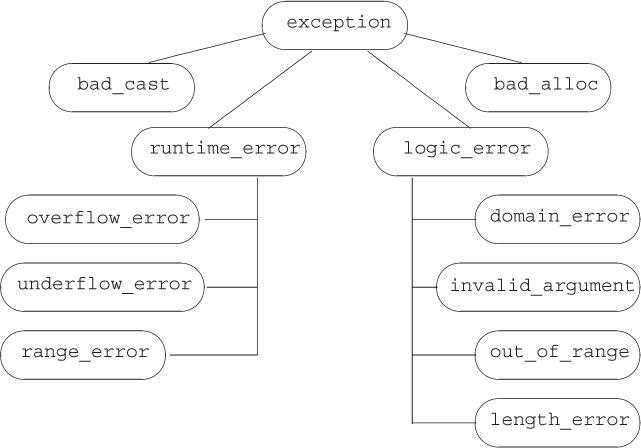

# 第 5 章 语句 (Statements)

## 简单语句（Simple Statements）

如果在程序的某个地方，语法上需要一条语句但是逻辑上不需要，则应该使用空语句（null statement）。空语句中只含有一个单独的分号`;`。

```c++
// read until we hit end-of-file or find an input equal to sought
while (cin >> s && s != sought)
    ;   // null statement
```

使用空语句时应该加上注释，从而令读这段代码的人知道该语句是有意省略的。

多余的空语句并非总是无害的。

```c++
// disaster: extra semicolon: loop body is this null statement
while (iter != svec.end()) ;    // the while body is the empty statement
    ++iter;     // increment is not part of the loop
```

复合语句（compound statement）是指用花括号括起来的（可能为空）语句和声明的序列。复合语句也叫做块（block），一个块就是一个作用域。在块中引入的名字只能在块内部以及嵌套在块中的子块里访问。通常，名字在有限的区域内可见，该区域从名字定义处开始，到名字所在（最内层）块的结尾处为止。

语句块不以分号作为结束。

空块的作用等价于空语句。

## 语句作用域（Statement Scope）

可以在`if`、`switch`、`while`和`for`语句的控制结构内定义变量，这些变量只在相应语句的内部可见，一旦语句结束，变量也就超出了其作用范围。

```c++
while (int i = get_num())   // i is created and initialized on each iteration
    cout << i << endl;
i = 0;  // error: i is not accessible outside the loop
```

## 条件语句（Conditional Statements）

### if 语句（The if Statement）

`if`语句的形式：

```c++
if (condition)
    statement
```

`if-else`语句的形式：

```c++
if (condition)
    statement
else
    statement2
```

其中*condition*是判断条件，可以是一个表达式或者初始化了的变量声明。*condition*必须用圆括号括起来。

- 如果*condition*为真，则执行*statement*。执行完成后，程序继续执行`if`语句后面的其他语句。
- 如果*condition*为假，则跳过*statement*。对于简单`if`语句来说，程序直接执行`if`语句后面的其他语句；对于`if-else`语句来说，程序先执行*statement2*，再执行`if`语句后面的其他语句。

`if`语句可以嵌套，其中`else`与离它最近的尚未匹配的`if`相匹配。

### switch 语句（The switch Statement）

`switch`语句的形式：


`switch`语句先对括号里的表达式求值，值转换成整数类型后再与每个`case`标签（case label）的值进行比较。如果表达式的值和某个`case`标签匹配，程序从该标签之后的第一条语句开始执行，直到到达`switch`的结尾或者遇到`break`语句为止。`case`标签必须是整型常量表达式。

通常情况下每个`case`分支后都有`break`语句。如果确实不应该出现`break`语句，最好写一段注释说明程序的逻辑。

尽管`switch`语句没有强制要求在最后一个`case`标签后写上`break`，但为了安全起见，最好添加`break`。这样即使以后增加了新的`case`分支，也不用再在前面补充`break`语句了。

`switch`语句中可以添加一个`default`标签（default label），如果没有任何一个`case`标签能匹配上`switch`表达式的值，程序将执行`default`标签后的语句。

即使不准备在`default`标签下做任何操作，程序中也应该定义一个`default`标签。其目的在于告诉他人我们已经考虑到了默认情况，只是目前不需要实际操作。

不允许跨过变量的初始化语句直接跳转到该变量作用域内的另一个位置。如果需要为`switch`的某个`case`分支定义并初始化一个变量，则应该把变量定义在块内。

```c++
case true:
{
    // ok: declaration statement within a statement block
    string file_name = get_file_name();
    // ...
}
```

## 迭代语句（Iterative Statements）

迭代语句通常称为循环，它重复执行操作直到满足某个条件才停止。`while`和`for`语句在执行循环体之前检查条件，`do-while`语句先执行循环体再检查条件。

### while 语句（The while Statement）

`while`语句的形式：

```c++
while (condition)
    statement
```

只要*condition*的求值结果为`true`，就一直执行*statement*（通常是一个块）。*condition*不能为空，如果*condition*第一次求值就是`false`，*statement*一次都不会执行。

定义在`while`条件部分或者循环体内的变量每次迭代都经历从创建到销毁的过程。

在不确定迭代次数，或者想在循环结束后访问循环控制变量时，使用`while`比较合适。

### 传统的 for 语句（Traditional for Statement）

`for`语句的形式：

```c++
for (initializer; condition; expression)
    statement
```

一般情况下，*initializer*负责初始化一个值，这个值会随着循环的进行而改变。*condition*作为循环控制的条件，只要*condition*的求值结果为`true`，就执行一次*statement*。执行后再由*expression*负责修改*initializer*初始化的变量，这个变量就是*condition*检查的对象。如果*condition*第一次求值就是`false`，*statement*一次都不会执行。*initializer*中也可以定义多个对象，但是只能有一条声明语句，因此所有变量的基础类型必须相同。

`for`语句头中定义的对象只在`for`循环体内可见。

### 范围 for 语句（Range for Statement）

范围`for`语句的形式：

```c++
for (declaration : expression)
    statement
```

其中*expression*表示一个序列，拥有能返回迭代器的`begin`和`end`成员。*declaration*定义一个变量，序列中的每个元素都应该能转换成该变量的类型（可以使用`auto`）。如果需要对序列中的元素执行写操作，循环变量必须声明成引用类型。每次迭代都会重新定义循环控制变量，并将其初始化为序列中的下一个值，之后才会执行*statement*。

### do-while 语句（The do-while Statement）

`do-while`语句的形式：

```c++
do
    statement
while (condition);
```

计算*condition*的值之前会先执行一次*statement*，*condition*不能为空。如果*condition*的值为`false`，循环终止，否则重复执行*statement*。

因为`do-while`语句先执行语句或块，再判断条件，所以不允许在条件部分定义变量。

## 跳转语句（Jump Statements）

跳转语句中断当前的执行过程。

### break 语句（The break Statement）

`break`语句只能出现在迭代语句或者`switch`语句的内部，负责终止离它最近的`while`、`do-while`、`for`或者`switch`语句，并从这些语句之后的第一条语句开始执行。

```c++
string buf;
while (cin >> buf && !buf.empty())
{
    switch(buf[0])
    {
        case '-':
            // process up to the first blank
            for (auto it = buf.begin()+1; it != buf.end(); ++it)
            {
                if (*it == ' ')
                break;  // #1, leaves the for loop
                // . . .
            }
            // break #1 transfers control here
            // remaining '-' processing:
            break;  // #2, leaves the switch statement
        case '+':
    // . . .
    } // end switch
// end of switch: break #2 transfers control here
} // end while
```

### continue 语句（The continue Statement）

`continue`语句只能出现在迭代语句的内部，负责终止离它最近的循环的当前一次迭代并立即开始下一次迭代。和`break`语句不同的是，只有当`switch`语句嵌套在迭代语句内部时，才能在`switch`中使用`continue`。

`continue`语句中断当前迭代后，具体操作视迭代语句类型而定：

- 对于`while`和`do-while`语句来说，继续判断条件的值。
- 对于传统的`for`语句来说，继续执行`for`语句头中的第三部分，之后判断条件的值。
- 对于范围`for`语句来说，是用序列中的下一个元素初始化循环变量。

### goto 语句（The goto Statement）

`goto`语句（labeled statement）是一种特殊的语句，在它之前有一个标识符和一个冒号。

```c++
end: return; // labeled statement; may be the target of a goto
```

标签标识符独立于变量和其他标识符的名字，它们之间不会相互干扰。

`goto`语句的形式：

```c++
goto label;
```

`goto`语句使程序无条件跳转到标签为*label*的语句处执行，但两者必须位于同一个函数内，同时`goto`语句也不能将程序的控制权从变量的作用域之外转移到作用域之内。

建议不要在程序中使用`goto`语句，它使得程序既难理解又难修改。

## try 语句块和异常处理（try Blocks and Exception Handling）

异常（exception）是指程序运行时的反常行为，这些行为超出了函数正常功能的范围。当程序的某一部分检测到一个它无法处理的问题时，需要使用异常处理（exception handling）。

异常处理机制包括`throw`表达式（throw expression）、`try`语句块（try block）和异常类（exception class）。

- 异常检测部分使用`throw`表达式表示它遇到了无法处理的问题（`throw`引发了异常）。
- 异常处理部分使用`try`语句块处理异常。`try`语句块以关键字`try`开始，并以一个或多个`catch`子句（catch clause）结束。`try`语句块中代码抛出的异常通常会被某个`catch`子句处理，`catch`子句也被称作异常处理代码（exception handler）。
- 异常类用于在`throw`表达式和相关的`catch`子句之间传递异常的具体信息。

### throw 表达式（A throw Expression）

`throw`表达式包含关键字`throw`和紧随其后的一个表达式，其中表达式的类型就是抛出的异常类型。

### try 语句块（The try Block）

`try`语句块的通用形式：

```c++
try
{
    program-statements
}
catch (exception-declaration)
{
    handler-statements
}
catch (exception-declaration)
{
    handler-statements
} // . . .
```

`try`语句块中的*program-statements*组成程序的正常逻辑，其内部声明的变量在块外无法访问，即使在`catch`子句中也不行。`catch`子句包含关键字`catch`、括号内一个对象的声明（异常声明，exception declaration）和一个块。当选中了某个`catch`子句处理异常后，执行与之对应的块。`catch`一旦完成，程序会跳过剩余的所有`catch`子句，继续执行后面的语句。

如果最终没能找到与异常相匹配的`catch`子句，程序会执行名为`terminate`的标准库函数。该函数的行为与系统有关，一般情况下，执行该函数将导致程序非正常退出。类似的，如果一段程序没有`try`语句块且发生了异常，系统也会调用`terminate`函数并终止当前程序的执行。

### 标准异常（Standard Exceptions）

异常类分别定义在 4 个头文件中：

- 头文件*exception*定义了最通用的异常类`exception`。它只报告异常的发生，不提供任何额外信息。

- 头文件*stdexcept*定义了几种常用的异常类。

  

- 头文件*new*定义了`bad_alloc`异常类。
- 头文件*type_info*定义了`bad_cast`异常类。

标准库异常类的继承体系：



只能以默认初始化的方式初始化`exception`、`bad_alloc`和`bad_cast`对象，不允许为这些对象提供初始值。其他异常类的对象在初始化时必须提供一个`string`或一个 C 风格字符串，通常表示异常信息。`what`成员函数可以返回该字符串的`string`副本。
