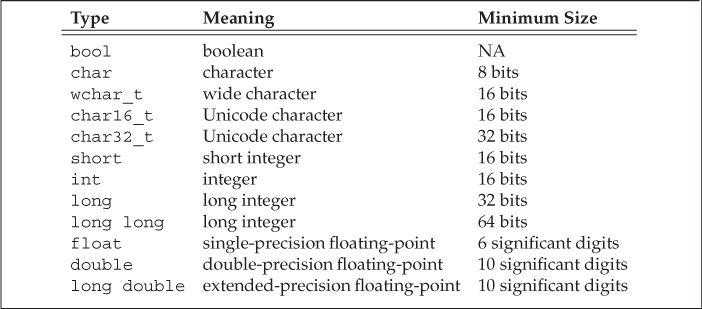

# 第 2 章 变量和基本类型(Variables and Basic Types)

## 2.1 基本内置类型 (Primitive Built-in Types)

### 2.1.1 算数类型 (Arithmetic Types)

算数类型分为两类：整型（integral type）、浮点型（floating-point type）。

`bool`类型的取值是`true`或`false`。

一个`char`的大小和一个机器字节一样，确保可以存放机器基本字符集中任意字符对应的数字值。`wchar_t`确保可以存放机器最大扩展字符集中的任意一个字符。

在整型类型大小方面，C++规定`short` ≤ `int` ≤ `long` ≤ `long long`（`long long`是 C++11 定义的类型）。

浮点型可表示单精度（single-precision）、双精度（double-precision）和扩展精度（extended-precision）值，分别对应`float`、`double`和`long double`类型。

除去布尔型和扩展字符型，其他整型可以分为带符号（signed）和无符号（unsigned）两种。带符号类型可以表示正数、负数和 0，无符号类型只能表示大于等于 0 的数值。类型`int`、`short`、`long`和`long long`都是带符号的，在类型名前面添加`unsigned`可以得到对应的无符号类型，如`unsigned int`。

字符型分为`char`、`signed char`和`unsigned char`三种，但是表现形式只有带符号和无符号两种。类型`char`和`signed char`并不一样， `char`的具体形式由编译器（compiler）决定。

如何选择算数类型：

- 当明确知晓数值不可能为负时，应该使用无符号类型。

- 使用`int`执行整数运算，如果数值超过了`int`的表示范围，应该使用`long long`类型。

- 在算数表达式中不要使用`char`和`bool`类型。如果需要使用一个不大的整数，应该明确指定它的类型是`signed char`还是`unsigned char`。

- 执行浮点数运算时建议使用`double`类型。
